# Enhanced RAG AI Pipeline

## 🚀 What's New

This project has been enhanced with a **modular, configuration-driven architecture** that makes it easier to maintain, customize, and extend.

### Key Improvements

- ✅ **YAML Configuration**: All settings centralized in `config/rag_config.yaml`
- ✅ **Modular Architecture**: Organized code in `src/` directory with clear separation
- ✅ **Type Safety**: Configuration validation with Pydantic models
- ✅ **Better Error Handling**: Structured logging and error management
- ✅ **Enhanced Streamlit App**: Improved UI with configuration display
- ✅ **Pipeline Orchestration**: Single command to set up the entire system

## 📁 New Project Structure

```
rag-ai-pipeline/
├── config/
│   └── rag_config.yaml              # 🆕 Centralized configuration
├── src/                             # 🆕 Modular source code
│   ├── config/
│   │   ├── __init__.py
│   │   └── config_loader.py         # Configuration management
│   ├── models/
│   │   └── llm_factory.py          # LLM creation factory
│   ├── data/
│   │   ├── document_loader.py      # PDF loading
│   │   └── text_splitter.py        # Document chunking
│   ├── vector_db/
│   │   └── pinecone_client.py      # Pinecone operations
│   ├── retrieval/
│   │   └── retrievers.py           # Custom retrievers
│   ├── chains/
│   │   └── rag_chain.py            # RAG chain implementation
│   ├── pipeline/
│   │   └── rag_pipeline.py         # 🌟 Main orchestrator
│   └── utils/
│       └── logger.py               # Logging utilities
├── data/external/                   # Your PDF files
├── env/api_keys.env                # API keys
├── main/v2_main.ipynb              # 🔄 Enhanced notebook
├── streamlit_app_new.py            # 🆕 Enhanced Streamlit app
├── requirements.txt                # 🔄 Complete dependencies
└── README_ENHANCED.md              # This file
```

## 🔧 Quick Start with Enhanced System

### 1. Install Dependencies

```bash
pip install -r requirements.txt
```

### 2. Configure Your Settings

Edit `config/rag_config.yaml` to customize:
- Models (embedding/chat)
- Retrieval settings
- Vector database configuration
- Prompts and behavior

### 3. Set Up API Keys

Create `env/api_keys.env`:
```
OPENAI_API_KEY=your_openai_key
PINECONE_API_KEY=your_pinecone_key
```

### 4. Add Your Documents

Place PDF files in `data/external/`

### 5. Set Up Virtual Environment

Create and activate a virtual environment:
```bash
python -m venv .venv
.venv\Scripts\activate  # Windows
```

### 6. Run the Application

**Option A: Streamlit App (Recommended)**

⚠️ **Important**: Use Python module execution to avoid launcher issues:
```bash
# Correct way (use Python module):
python -m streamlit run streamlit_app_new.py

# If using virtual environment directly:
".venv\Scripts\python.exe" -m streamlit run streamlit_app_new.py
```

**Option B: Jupyter Notebook**
- Open `main/v2_main.ipynb` or `notebooks/v2_main.ipynb`
- Run the enhanced configuration cells
- Set `USE_NEW_PIPELINE = True`

**Option C: Python Script**
```python
from src.pipeline.rag_pipeline import create_pipeline

# Create and setup pipeline
pipeline = create_pipeline()
pipeline.full_setup()  # One command setup!

# Ask questions
response = pipeline.ask_question("What is value investing?")
print(response['answer'])
```

## � Video Demo

Watch the demo: [https://youtu.be/MrQ79ooAkZ8](https://youtu.be/MrQ79ooAkZ8)

## �🔧 Troubleshooting

### Streamlit Launcher Issues

**Problem**: `Fatal error in launcher: Unable to create process using [path to python.exe]`

**Solution**: Always run Streamlit as a Python module instead of using the launcher:
```bash
# ✅ Correct
python -m streamlit run streamlit_app_new.py

# ❌ Avoid (can have launcher issues)
streamlit run streamlit_app_new.py
```

### Legacy File Compatibility

This project maintains compatibility with older scripts and notebooks that reference `streamlit_app.py`. A redirect file automatically forwards requests to `streamlit_app_new.py` with a warning message.

### Session State Widget Errors

If you encounter widget key modification errors in Streamlit, avoid programmatically modifying `st.session_state` for widget keys after creating the widget. Let users manually clear inputs or use form submission patterns instead.

## 📁 File Organization

### Current Files
- `streamlit_app_new.py` - **Main Streamlit application**
- `streamlit_app.py` - Redirect file for legacy compatibility
- `legacy/` - Contains backup versions and legacy implementations
- `notebooks/` - Jupyter notebooks with different versions
- `src/` - Modular source code architecture

### Archive Organization
Legacy files are organized in the `legacy/` folder:
- `streamlit_app_legacy.py` - Original implementation  
- `streamlit_app_backup.py` - Backup version
- `streamlit_app.py` (in legacy) - Previous version

**Best Practice**: When adding new versions, move old implementations to `legacy/` with descriptive names and timestamps.

## 🎯 Configuration Examples

### Change Models
```yaml
# In config/rag_config.yaml
models:
  embedding:
    model: "text-embedding-3-large"  # More accurate
    dimension: 3072
  chat:
    model: "gpt-4o"                  # More powerful
    temperature: 0.2                 # More creative
```

### Adjust Retrieval
```yaml
retrieval:
  k: 15  # Retrieve more documents
  
document_processing:
  chunk_size: 1000    # Larger chunks
  chunk_overlap: 200  # More overlap
```

### Customize Prompts
```yaml
prompts:
  system_prompt: |
    You are a specialized financial advisor...
    [Your custom prompt here]
```

## � How RAG Works: Complete Process Flow

### RAG (Retrieval-Augmented Generation) Architecture

This system combines document retrieval with AI language models to answer questions based on your specific documents. Here's how it works step-by-step:

```mermaid
graph LR
    A["📄 Load Documents<br/>(PDFs from data/external/)"] 
    B["✂️ Split into Chunks<br/>(Document Splitter)"]
    C["🔢 Generate Embeddings<br/>(OpenAI Embeddings)"]
    D["📦 Store in Vector DB<br/>(Pinecone)"]
    E["❓ User Question"]
    F["🔍 Generate Query Embedding<br/>(Same Embeddings Model)"]
    G["🎯 Retrieve Similar Docs<br/>(Semantic Search in Pinecone)"]
    H["📋 Format Context<br/>(Top K Documents)"]
    I["🤖 LLM Generation<br/>(GPT-4 with Context)"]
    J["✅ Answer with Citations"]
    
    A --> B
    B --> C
    C --> D
    E --> F
    F --> G
    G --> H
    D -.-> G
    H --> I
    I --> J
    
    style A fill:#e1f5ff,color:#0277bd,font-weight:bold
    style B fill:#e1f5ff,color:#0277bd,font-weight:bold
    style C fill:#fff3e0,color:#0277bd,font-weight:bold
    style D fill:#fff3e0,color:#0277bd,font-weight:bold
    style E fill:#f3e5f5,color:#0277bd,font-weight:bold
    style F fill:#f3e5f5,color:#0277bd,font-weight:bold
    style G fill:#f3e5f5,color:#0277bd,font-weight:bold
    style H fill:#c8e6c9,color:#0277bd,font-weight:bold
    style I fill:#c8e6c9,color:#0277bd,font-weight:bold
    style J fill:#fce4ec,color:#0277bd,font-weight:bold
```



### Step-by-Step Explanation

#### **Phase 1: Document Preparation (One-time Setup)**

**Step 1: Load Documents**
- Your PDF files are loaded from `data/external/` directory
- The system reads all PDF content into memory
- Example: Load "Investment_Guide.pdf", "Stock_Basics.pdf", etc.

**Step 2: Split Documents into Chunks**
- Large documents are split into smaller, manageable pieces (chunks)
- Default: 1000 characters per chunk, 200 character overlap for context preservation
- Overlapping ensures important information at chunk boundaries isn't lost
```python
# Configuration for splitting
chunk_size: 1000      # Characters per chunk
chunk_overlap: 200    # Overlap between chunks
```

**Step 3: Generate Embeddings**
- Each chunk is converted into a numerical vector representation using OpenAI's embedding model
- Embeddings capture the semantic meaning of text (similar content has similar vectors)
- Example: "stock portfolio" and "investment collection" get similar embeddings
```python
# Embedding model configuration
embedding_model: "text-embedding-3-large"  # 3,072 dimensions
```

**Step 4: Store in Vector Database (Pinecone)**
- All embeddings and their source documents are stored in Pinecone
- Pinecone enables fast similarity search across millions of vectors
- Documents are indexed and ready for retrieval
```
Pinecone Index Structure:
├── Vector 1 (chunk 1) → metadata: {source: pdf1, page: 5}
├── Vector 2 (chunk 2) → metadata: {source: pdf1, page: 6}
├── Vector 3 (chunk 3) → metadata: {source: pdf2, page: 2}
...
```

#### **Phase 2: Question Answering (At Query Time)**

**Step 5: User Asks a Question**
- User inputs a question via the Streamlit interface
- Example: "What is value investing?"

**Step 6: Embed the User Question**
- The same embedding model converts the question into a vector
- Critical: Using the **same embedding model** ensures comparability
- The question vector now lives in the same 3,072-dimensional space as document chunks

**Step 7: Retrieve Similar Documents**
- Semantic search in Pinecone finds chunks with embeddings most similar to the question
- Similarity is measured using vector distance (cosine similarity)
- Default: Retrieves top 10 most relevant chunks
```python
# Retrieval configuration
k: 10  # Number of documents to retrieve
search_type: "semantic"  # Semantic similarity search
```

**Step 8: Format as Context**
- Retrieved chunks are formatted into a clear, readable context
- Metadata is preserved (source, page number)
- Creates the "context" that will guide the LLM's answer
```
Formatted Context:
---
Source: Investment_Guide.pdf (Page 15)
Value investing is the practice of buying securities that appear 
underpriced relative to their intrinsic value...

Source: Stock_Basics.pdf (Page 42)
Warren Buffett popularized value investing as a disciplined 
approach to long-term wealth building...
---
```

**Step 9: Generate Answer with LLM**
- The question and retrieved context are sent to GPT-4
- The LLM system prompt instructs it to answer based on the documents
- LLM synthesizes information from multiple chunks into a coherent answer
```python
# LLM Configuration
model: "gpt-4o"
temperature: 0.1  # Lower = more factual, less creative
max_tokens: 1200  # Allows detailed answers
```

**Step 10: Return Answer**
- The LLM generates an answer grounded in your documents
- Answer includes references to source documents
- User gets practical, document-backed information
```
Answer Example:
"Value investing is the practice of buying securities that appear 
underpriced relative to their intrinsic value. Based on Investment_Guide.pdf 
(Page 15), this approach focuses on fundamental analysis rather than market trends..."
```

### Why RAG is Powerful

| Aspect | Without RAG | With RAG |
|--------|------------|----------|
| **Knowledge Source** | Trained model (outdated) | Your specific documents (current) |
| **Hallucinations** | Can make up false information | Grounded in actual documents |
| **Customization** | Generic answers | Domain-specific answers |
| **Transparency** | "Black box" responses | Cited sources visible |
| **Cost** | Expensive fine-tuning | Efficient retrieval + LLM |

### Example Workflow

```python
# 1. One-time setup
from src.pipeline.rag_pipeline import create_pipeline

pipeline = create_pipeline()
pipeline.full_setup()  # Loads, embeds, and stores all documents

# 2. Question answering (repeatable)
result = pipeline.ask_question("What is value investing?")
print(result['answer'])           # The AI answer
print(result['sources'])          # Which documents were used
```

## �🔄 Migration from Legacy

If you have the old version:

1. **Keep your existing notebook** - it still works!
2. **Try the new system** - run the enhanced cells
3. **Gradually migrate** - use `USE_NEW_PIPELINE = True`

Both approaches coexist peacefully.

## 🛠️ Development

### Adding New Features

1. **New Models**: Add to `src/models/llm_factory.py`
2. **New Retrievers**: Add to `src/retrieval/retrievers.py`
3. **New Configurations**: Add to `config/rag_config.yaml` and `config_loader.py`

### Testing

```bash
# Run the pipeline test
python -m src.pipeline.rag_pipeline

# Test configuration loading
python -m src.config.config_loader
```

## 🎨 Advanced Features

### Custom Vector Database
Easily switch to Weaviate, Qdrant, etc. by:
1. Adding new client in `src/vector_db/`
2. Updating configuration
3. Creating new retriever

### Hybrid Search
Combine multiple retrieval methods:
```python
from src.retrieval.retrievers import HybridRetriever

hybrid = HybridRetriever([retriever1, retriever2], weights=[0.7, 0.3])
```

### Caching
Enable caching in configuration:
```yaml
performance:
  enable_caching: true
```

## 🐛 Troubleshooting

### "Module not found" errors
- Make sure you're in the project root directory
- Check that `src/` directory contains all modules
- Verify Python path is set correctly

### Configuration errors
- Validate your YAML syntax
- Check required sections exist
- Use the configuration test: `python -m src.config.config_loader`

### API key issues
- Verify `env/api_keys.env` exists and has correct keys
- Check file permissions

## 🤝 Contributing

1. **Add features to modular structure**
2. **Update configuration schema**
3. **Add tests**
4. **Update this README**

## 📊 Performance Benefits

| Aspect | Legacy | Enhanced |
|--------|--------|----------|
| Setup Time | Manual, error-prone | One command |
| Configuration | Scattered in code | Centralized YAML |
| Maintenance | Difficult | Easy |
| Testing | Manual | Automated |
| Extensibility | Limited | High |

---

🎉 **The enhanced system maintains 100% backward compatibility while providing a modern, scalable architecture for your RAG pipeline!**